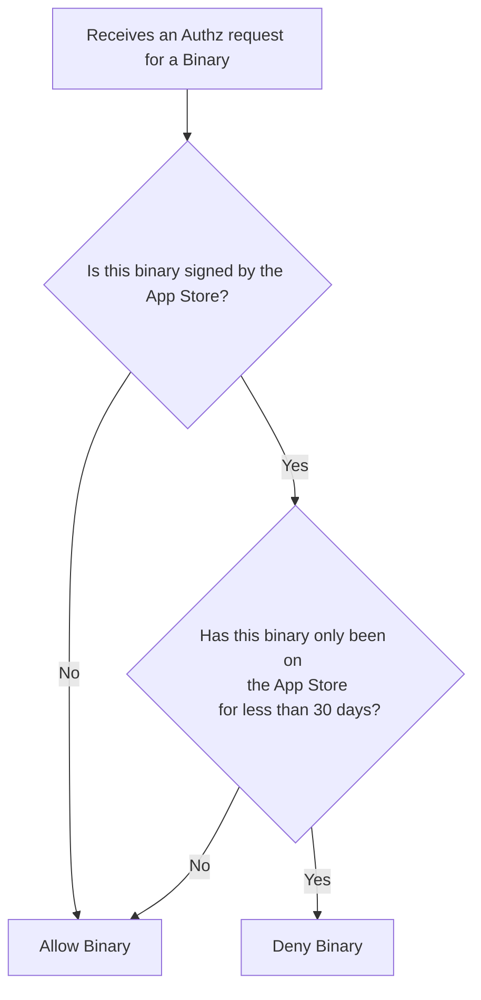
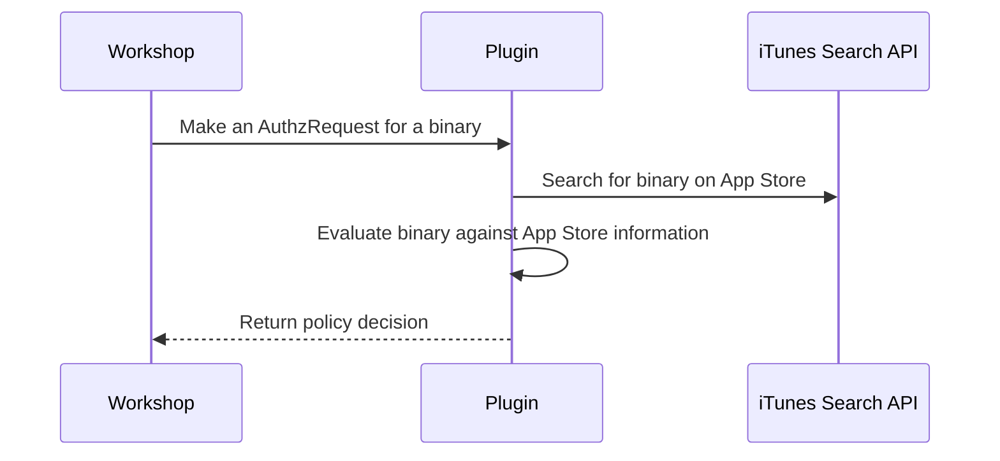

# Remote Risk Engine Demo

This repository shows how to write a basic remote risk engine plugin
for North Pole Security's Workshop. 

It issues a deny response if the binary is from an Apple App Store
application that has not been on the App store for less than 30 days.

> [!WARNING]  
> This code is intended only for demo purposes and should not be
considered production ready.
>
> The iTunes Search API is limited to 20 queries per minute and
> this server uses hard coded secrets.

## Building 

- Simply run `go build -o plugin-server ./cmd/server.go`

## Running

- Just run the resulting binary `./plugin-server`

## Configuring Workshop to Use the Remote Risk Engine Plugin

- 1. Use the `Settings API` to ensure the risk engine is enabled and configured to use the remote risk engine

Configure the remote risk engine to use the plugin. In this case the
plugin is hosted on localhost and exposed to the Workshop server via 
docker and runs on port 8888

```json
{
  "enabled": true,
  "remotePlugins": [{
     "enabled": true,
     "name": "demo",
     "version": "0.0.1",
     "url": "http://host.docker.internal:8888", <-- change this to your
     "headers": [{"key": "X-API-KEY", "value": "my-secret-api-key"}],
     "ttl": "120.0s"}]
}
```

You can do this by running the following `grpcurl` command:

```shell
grpcurl -plaintext -H "Authorization: $WORKSHOP_API_KEY" -d '{"riskEngineSettings":{"enabled":true,"remotePlugins":[{"enabled":true,"name":"demo-plugin","version":"0.0.1","url":"http://host.docker.internal:8888","headers":[{"key":"X-API-KEY","value":"my-secret-api-key"}],"ttl":"120.0s"}]}}' localhost:8080 workshop.v1.WorkshopService/UpdateSettings
```

You can check that the settings were applied using the `GetSettingss`
API. 

```shell
$  grpcurl -plaintext -H "Authorization: $WORKSHOP_API_KEY" -d {} localhost:8080 workshop.v1.WorkshopService/GetSettings
{
  "syncSettings": {
    "enableBundles": true,
    "enableAllEventUpload": true
  },
  "riskEngineSettings": {
    "enabled": true,
    "pluginTimeout": "120s",
    "localPlugins": {
      "virusTotal": {
        "enabled": false,
        "apiKey": "",
        "cacheTtl": "60s",
        "numCacheEntries": 10
      },
      "reversingLabs": {
        "enabled": false,
        "username": "",
        "password": "",
        "cacheTtl": "600s",
        "numCacheEntries": 1000
      },
      "blockableRules": {
        "enabled": true,
        "rules": [
          {
            "rule": "blockable.team_id == \"EQHXZ8M8AV\"",
            "comment": "test rule"
          }
        ]
      }
    },
    "remotePlugins": [
      {
        "enabled": true,
        "name": "demo-plugin",
        "version": "0.0.1",
        "uuid": "a3edf34c-5825-46cd-b121-0b2681c4bd44",
        "url": "http://host.docker.internal:8888",
        "headers": [
          {
            "key": "X-API-KEY",
            "value": "my-secret-api-key"
          }
        ],
        "ttl": "120s"
      }
    ]
  }
}
```


- 2. Use configure the `CheckBlockable` API call to invoke the risk engine 

You can check the Risk Engine is working properly by invoking the
`CheckBlockable` API. This covers an entire blockable (binary
attributes that Santa can block on.)

```shell
$  grpcurl -plaintext -H "Authorization: $WORKSHOP_API_KEY" -d '{"blockable": {"sha256": "4e4eea34dc9d936ba7d60f8814dc1d0c87d48c88d68bbf14cde97d8a33663842"}}' localhost:8080 workshop.v1.WorkshopService/CheckBlockable
{
  "results": [
    {
      "timestamp": "2025-03-05T18:30:06.041106709Z",
      "goodUntil": "3000-12-25T00:00:00Z",
      "txId": "050bc98c-189b-4da6-9665-871955f769dd",
      "allowed": true,
      "decision": "DECISION_ALLOW",
      "pluginName": "Blockable Rules (1.0.0)",
      "pluginUuid": "51d20397-d4f2-4bc8-915b-137dcb841548",
      "explanation": "No rules matched"
    },
    {
      "timestamp": "2025-03-05T18:30:06.041106709Z",
      "goodUntil": "1970-01-01T00:00:00Z",
      "txId": "050bc98c-189b-4da6-9665-871955f769dd",
      "allowed": true,
      "decision": "DECISION_ALLOW",
      "pluginUuid": "271b581e-498c-4ef0-95f2-57cdc6330e22",
      "explanation": "Binary is not not from the app store"
    },
    {
      "timestamp": "2025-03-05T18:30:06.041106709Z",
      "goodUntil": "2025-03-05T18:31:06.040980876Z",
      "txId": "050bc98c-189b-4da6-9665-871955f769dd",
      "allowed": true,
      "decision": "DECISION_ALLOW",
      "pluginName": "VirusTotal (1.0.0)",
      "pluginUuid": "8f239575-826e-4909-9489-a6d36d663b7a",
      "explanation": "File is not known malicious at this time"
    }
  ]
}
```


- 3. Watch the plugin server's output to see it receive requests and
  make decisions.

When Workshop calls into the plugin it will print its decisions out
to stderr using go's log module.

```shell
$  go run ./cmd/server.go 
2025/03/04 20:00:53 Starting HTTP server...
2025/03/04 20:01:09 Binary:  Things3
2025/03/04 20:01:09 Decision: DECISION_ALLOW
2025/03/04 20:01:09 Team ID:  JLMPQHK86H
2025/03/04 20:01:09 App Store URL:  https://apps.apple.com/us/app/things-3/id904280696?mt=12&uo=4
2025/03/04 20:01:09 Good until:  3000-12-25 00:00:00 +0000 UTC
2025/03/04 20:01:09 
2025/03/04 20:01:09 
```

## Policy Enforced by the Plugin

This plugin uses the code signing information of a binary to see if
it's from the App Store. It then checks the iTunes Search API to see
when the first release of the application was added to the App Store.
If it was added less than 30 days prior the plugin returns a deny
response and allows otherwise.

This can be summarized as follows:




## Interactions


