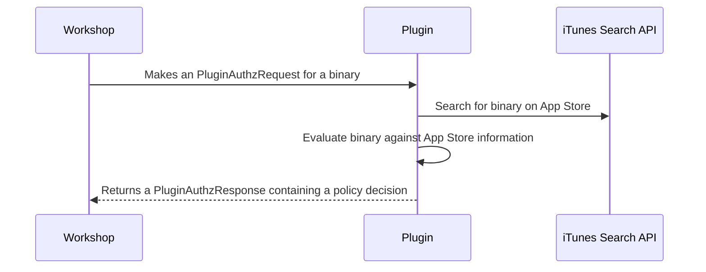
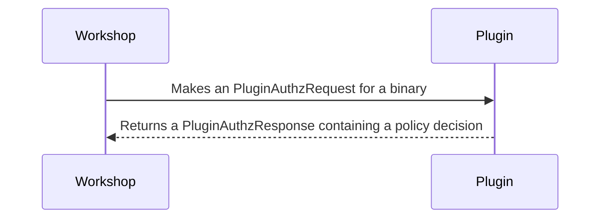

# Remote Risk Engine Demo

This repository shows how to write a **Remote Risk Engine** plugin
for North Pole Security's [Workshop](https://northpole.security).

This example plugin evaluates binaries based on their App Store presence. It verifies code signing information to confirm App Store origin and queries the iTunes Search API to determine the application's release date. The plugin implements a simple risk policy: applications released on the App Store less than 30 days ago are denied, while those with longer market presence are allowed.

> [!WARNING]
> This code is intended only for demo purposes and should not be
considered production ready.
>
> The iTunes Search API is limited to 20 queries per minute and
> this server uses hard coded secrets.

## Prerequisites

Make sure you have Workshop running. For this example we'll assume Workshop is listening on `localhost:8080`.

You'll need to create an API key with read-write access. Workshop API keys begin with `npsws_sk_`.

## Build & Run

```sh
$ go build -o plugin-server ./cmd/server.go
$ ./plugin-server
```

The plugin server should now be listening at localhost on port 8888.

## Enable the Plugin

First, configure Workshop to use the plugin using the `UpdateSettings` API method using the JSON payload below. We'll assume that Workshop is running in Docker, so Workshop will need to point to `http://host.docker.internal:8888` in order to access the plugin server:

```json
{
  "enabled": true,
  "remotePlugins": [
    {
      "enabled": true,
      "name": "demo",
      "version": "0.0.1",
      "url": "http://host.docker.internal:8888",
      "headers": [{"key": "X-API-Key", "value": "sekrit"}],
      "ttl": "120.0s"
    }
  ]
}
```

You can send an API request using the `gprcurl` command like this:

```sh
$ grpcurl -plaintext \
  -H "Authorization: $WORKSHOP_API_KEY" \
  -d '{"riskEngineSettings":{"enabled":true,"remotePlugins":[{"enabled":true,"name":"demo-plugin","version":"0.0.1","url":"http://host.docker.internal:8888","headers":[{"key":"X-API-Key","value":"sekrit"}],"ttl":"120.0s"}]}}' \
  localhost:8080 workshop.v1.WorkshopService/UpdateSettings
```

Check that the settings were applied using the `GetSettings` method:

```sh
$ grpcurl -plaintext \
  -H "Authorization: $WORKSHOP_API_KEY" \
  localhost:8080 workshop.v1.WorkshopService/GetSettings

{
  ...
  "riskEngineSettings": {
    "enabled": true,
    "pluginTimeout": "120s",
    "localPlugins": {
      ...
    },
    "remotePlugins": [
      {
        "enabled": true,
        "name": "demo-plugin",
        "version": "0.0.1",
        "uuid": "a3edf34c-5825-46cd-b121-0b2681c4bd44",
        "url": "http://host.docker.internal:8888",
        "headers": [
          {
            "key": "X-API-Key",
            "value": "sekrit"
          }
        ],
        "ttl": "120s"
      }
    ]
  }
}
```

## Test the Plugin

You can check the Remote Risk Engine plugin is working properly by using the `CheckBlockable` API method to check a binary. We've picked an arbitrary SHA256 as an identifier for this example, but you could get one yourself using `santactl fileinfo <path-to-binary>` if you wanted.

```sh
$ grpcurl \
  -plaintext -H "Authorization: $WORKSHOP_API_KEY" \
  -d '{"blockable": {"sha256": "4e4eea34dc9d936ba7d60f8814dc1d0c87d48c88d68bbf14cde97d8a33663842"}}' \
  localhost:8080 workshop.v1.WorkshopService/CheckBlockable

{
  "results": [
    {
      "timestamp": "2025-03-05T18:30:06.041106709Z",
      "goodUntil": "3000-12-25T00:00:00Z",
      "txId": "050bc98c-189b-4da6-9665-871955f769dd",
      "allowed": true,
      "decision": "DECISION_ALLOW",
      "pluginName": "Blockable Rules (1.0.0)",
      "pluginUuid": "51d20397-d4f2-4bc8-915b-137dcb841548",
      "explanation": "No rules matched"
    },
    {
      "timestamp": "2025-03-05T18:30:06.041106709Z",
      "goodUntil": "1970-01-01T00:00:00Z",
      "txId": "050bc98c-189b-4da6-9665-871955f769dd",
      "allowed": true,
      "decision": "DECISION_ALLOW",
      "pluginUuid": "271b581e-498c-4ef0-95f2-57cdc6330e22",
      "explanation": "Binary is not not from the app store"
    },
    {
      "timestamp": "2025-03-05T18:30:06.041106709Z",
      "goodUntil": "2025-03-05T18:31:06.040980876Z",
      "txId": "050bc98c-189b-4da6-9665-871955f769dd",
      "allowed": true,
      "decision": "DECISION_ALLOW",
      "pluginName": "VirusTotal (1.0.0)",
      "pluginUuid": "8f239575-826e-4909-9489-a6d36d663b7a",
      "explanation": "File is not known malicious at this time"
    }
  ]
}
```

When Workshop calls the plugin, it should log its decisions to stderr:

```sh
$ ./plugin-server
2025/03/04 20:00:53 Starting HTTP server on port 8888...
2025/03/04 20:01:09 Binary:  Things3
2025/03/04 20:01:09 Decision: DECISION_ALLOW
2025/03/04 20:01:09 Team ID:  JLMPQHK86H
2025/03/04 20:01:09 App Store URL:  https://apps.apple.com/us/app/things-3/id904280696?mt=12&uo=4
2025/03/04 20:01:09 Good until:  3000-12-25 00:00:00 +0000 UTC
```

## Workflow Diagram


## Interaction Diagram



## Writing Your Own Remote Risk Engine Plugin

Whenever Workshop encounters a new binary the Risk Engine and its plugins are
consulted. While Workshop includes some baked in plugins (e.g. VirusTotal, ReversingLabs and Blockable Rules) users can also extend this functionality by writing a remote plugin that conforms the remote risk engine plugin protocol.

>[!Note] In order for a binary to be approved all configured risk engine plugins must return a decision of approved.

To write your own remote risk engine plugin you need to simply create a server
that takes an HTTP POST with JSON consisting of the `PluginAuthzRequest` and
that returns an `PluginAuthzResponse` serialized to JSON.

The interaction is essentially as follows:



>[!Note] Plugin authors are responsible for TLS and authorization. So you are encouraged to use best practices.

### Handling Requests

The first step is to make a webservice that can receive and unmarshal a `PluginAuthzRequest`.

```proto
// A PluginAuthzRequest is a request made by Workshop to 
// a plugin to authorize a  binary / blockable.
message PluginAuthzRequest {
  string tx_id = 1;               // The transaction ID of the request.
  BinaryBlockable blockable = 2;  // The binary to authorize with all blockable attributes.
  google.protobuf.Timestamp timestamp = 3; // The timestamp of the request.
  google.protobuf.Timestamp deadline = 4; // The deadline for the plugin to return a decision before it is automatically considered a denial.
}
```

After unmarshaling the `PluginAuthzRequest` you can find all of the details
about the binary in the `blockable` field. This contains a subset of the attributes
Santa has recorded at the time of execution, including signing information.

Each request has a transaction ID (`tx_id`) field and all responses are expected to have the same value in their transaction ID field.

Each `PluginAuthzRequest` also contains a `deadline` that the plugin must respond
with a `PluginAuthzResponse` before to be considered. Failure to respond within
the deadline will be treated as a if the plugin had responded with a deny
decision.

Once the data from the request has been processed a `PluginAuthzResponse` must be send back to Workshop with a decision and and explanation for the decision.

The structure of the `PluginAuthzResponse` is as follows:

```proto
// This message is used by a remote risk engine plugin to represent the decision
// for a blockable.  All errors and timeouts are treated as denials.
message PluginAuthzResponse {
  string tx_id = 1; // The transaction ID of the request this response is for.
  Decision decision = 2; // The decision for the blockable.
  Explanation explanation = 3; // An explanation for the decision.
  string error = 4; // An error message containing any errors the plugin encountered.
  string plugin_uuid = 5; // The UUID of the plugin that made the decision.
  google.protobuf.Timestamp good_until = 6; // The time the decision is considered valid until for caching.
}
```

Decisions can be one of the following:

| Decision |  Meaning |
|---|---|
| UNKNOWN | This is a programming error and should not be used |
| DENY | The plugin has determined the binary should be blocked by policy. |
| DENY_MALWARE | The plugin has determined the binary is malware and should be blocked |
| ALLOW | The plugin believes this binary is safe. |
| TIMEOUT | The plugin or something it depends on has timed out |
| ERROR | The plugin has encountered an error |

All decisions except for allow are considered a denial.

```proto
// Decision values for a remote risk engine plugin may return for a binary.
enum Decision {
  DECISION_UNKNOWN = 0;
  DECISION_DENY = 1;
  DECISION_DENY_MALWARE = 2;
  DECISION_ALLOW = 3;
  DECISION_TIMEOUT = 4;
  DECISION_ERROR = 5;
}
```

Additionally plugin authors are expected to provide an explanation for the
decision and optionally a URL for getting more information. Workshop presents this information to to users and also helps with debugging.

```proto
// An Explanation is used to provide a message to the user when a blockable is
// evaluated.
message Explanation {
  string message = 1; // Message to present to the user / other part of workshop
  string url = 2; // URL to present to the user for more information.
  bool is_json = 3; // Whether or not the content of the message field is JSON.
}
```