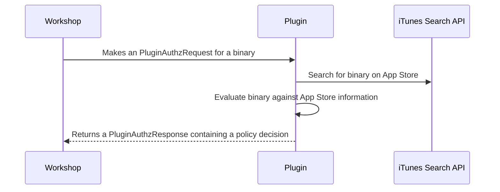

# Remote Risk Engine Demo

This repository shows how to write a **Remote Risk Engine** plugin
for North Pole Security's [Workshop](https://northpole.security).

This example plugin evaluates binaries based on their App Store presence. It verifies code signing information to confirm App Store origin and queries the iTunes Search API to determine the application's release date. The plugin implements a simple risk policy: applications released on the App Store less than 30 days ago are denied, while those with longer market presence are allowed.

> [!WARNING]
> This code is intended only for demo purposes and should not be
considered production ready.
>
> The iTunes Search API is limited to 20 queries per minute and
> this server uses hard coded secrets.

## Prerequisites

- A Workshop instance
- Workshop Admin permissions

For this example we'll assume that your plugin is reachable at
`plugin.example.com:8888`

## Build & Run

```sh
$ go build -o plugin-server ./cmd/server.go
$ ./plugin-server
```

The plugin server should now be listening on port 8888.

## Enable the Plugin

### Using the UI

If you're using the UI, you can simply browse to the `/settings` page and click on Remote Risk Engine plugins tab and fill in the form.

### Via the API

First, configure Workshop to use the plugin using the [`UpdateRiskEngineSettings` method](https://buf.build/northpolesec/workshop-api/docs/main:workshop.v1#workshop.v1.WorkshopService.UpdateRiskEngineSettings) using the JSON payload below changing `plugin.example.com` to the address you're plugin is running at. 

```json
{
  "enabled": true,
  // ... SNIPPED
  "remotePlugins": [
    {
      "enabled": true,
      "name": "demo",
      "version": "0.0.1",
      "url": "https://plugin.example.com:8888",
      "headers": [{"key": "X-API-Key", "value": "sekrit"}],
      "ttl": "120.0s"
    }
  ]
}
```

Check that the settings were applied using the [`GetRiskEngineSettings` method](https://buf.build/northpolesec/workshop-api/docs/main:workshop.v1#workshop.v1.WorkshopService.UpdateRiskEngineSettings):

```shell
$ grpcurl \
  -H "Authorization: $WORKSHOP_API_KEY" \
  nps.workshop.cloud:443 workshop.v1.WorkshopService/GetRiskEngineSettings
```

You should see your plugin matching:

```json
{
  "riskEngineSettings": {
    "enabled": true,
    "localPlugins": {
     // SNIPPED
    },
    "remotePlugins": [
      {
        "enabled": true,
        "name": "iTunes Store Plugin",
        "version": "1.0.0",
        "uuid": "e0fb4e11-9b00-4c79-8876-eb01971cb708",
        "url": "https://plugin.example.com:8888",
        "headers": [
          {
            "key": "X-API-Key",
            "value": "sekrit"
          }
        ],
        "ttl": "60s"
      }
    ]
  }
}
```

## Test the Plugin

### Testing via the Workshop UI

In the Workshop UI go to the Risk Engine card on the Settings page. Click `Test
Configuration` and drag in an application. You should see your remote plugin
being called in the list of Risk Engine Plugins.


### Testing via the API

You can check the Remote Risk Engine plugin is working properly in Workshop by
calling the [`CheckBlockable` method](https://buf.build/northpolesec/workshop-api/docs/main:workshop.v1#workshop.v1.WorkshopService.CheckBlockable) to evaluate a binary. 

The `CheckBlockable` method will fill in other details for the blockable field
from Workshop's database if only the SHA256 is filled in.

In this example we've picked an arbitrary SHA256 as an identifier for this
example, but you could get one yourself using `santactl fileinfo
<path-to-binary>` if you wanted.

E.g. Checking Things3.app from the App Store you should see.

```sh
$  grpcurl \
  -H "Authorization: $WORKSHOP_API_KEY" \
  -d '{"blockable": {"sha256": "762fb9cdc3d9bf0d42800c4f887604f26af625c7b94de142ec5f72864486b1ba"}}' \
  nps.workshop.cloud:443 workshop.v1.WorkshopService/CheckBlockable
{
  "results": [
    {
      "timestamp": "2025-08-18T17:35:41.308688547Z",
      "goodUntil": "2025-08-19T17:35:41.004858863Z",
      "txId": "addd8379-6ad9-449e-8351-078a36f9a987",
      "allowed": true,
      "decision": "DECISION_ALLOW",
      "pluginName": "ReversingLabs (1.0.0)",
      "pluginUuid": "0446500a-2d50-475e-860c-f796c39dd41e",
      "explanation": "File is not flagged malicious by ReversingLabs"
    },
    {
      "timestamp": "2025-08-18T17:35:41.308688547Z",
      "goodUntil": "3000-12-25T00:00:00Z",
      "txId": "addd8379-6ad9-449e-8351-078a36f9a987",
      "allowed": true,
      "decision": "DECISION_ALLOW",
      "pluginName": "BlockableRule:Virtualization Software (1.0.0)",
      "pluginUuid": "6b367847-7b45-48a5-9cc6-4e0658dd660e",
      "explanation": "Rule did not match"
    },
    {
      "timestamp": "2025-08-18T17:35:41.308688547Z",
      "goodUntil": "3000-12-25T00:00:00Z",
      "txId": "addd8379-6ad9-449e-8351-078a36f9a987",
      "allowed": true,
      "decision": "DECISION_ALLOW",
      "pluginName": "BlockableRule:Flag VPNs (1.0.0)",
      "pluginUuid": "0d50a299-1ef7-4e4b-8509-d28c1aae4990",
      "explanation": "Rule did not match"
    },
    {
      "timestamp": "2025-08-18T17:35:41.308688547Z",
      "goodUntil": "3000-12-25T00:00:00Z",
      "txId": "addd8379-6ad9-449e-8351-078a36f9a987",
      "allowed": true,
      "decision": "DECISION_ALLOW",
      "pluginName": "BlockableRule:App uses camera or mic (1.0.0)",
      "pluginUuid": "eed8f509-0046-4bdd-a39c-d12d7ca261d4",
      "explanation": "Rule did not match"
    },
    {
      "timestamp": "2025-08-18T17:35:41.308688547Z",
      "goodUntil": "3000-12-25T00:00:00Z",
      "txId": "addd8379-6ad9-449e-8351-078a36f9a987",
      "allowed": true,
      "decision": "DECISION_ALLOW",
      "pluginName": "iTunes Store Plugin (1.0.0)",
      "pluginUuid": "e0fb4e11-9b00-4c79-8876-eb01971cb708",
      "explanation": "App (com.culturedcode.ThingsMac) has been on the App Store for more than a month",
      "url": "https://apps.apple.com/us/app/things-3/id904280696?mt=12\u0026uo=4"
    }
  ]
}
```

When Workshop calls the plugin, you'll see its logs on stderr:

```sh
$ ./plugin-server
2025/03/04 20:00:53 Starting HTTP server on port 8888...
2025/03/04 20:01:09 Binary:  Things3
2025/03/04 20:01:09 Decision: DECISION_ALLOW
2025/03/04 20:01:09 Team ID:  JLMPQHK86H
2025/03/04 20:01:09 App Store URL:  https://apps.apple.com/us/app/things-3/id904280696?mt=12&uo=4
2025/03/04 20:01:09 Good until:  3000-12-25 00:00:00 +0000 UTC
```

This sets a Good until time far into the distant future as the binary will
always be first published more than 30 days ago from now.

## Workflow Diagram


## Interaction Diagram



## Writing Your Own Remote Risk Engine Plugin

Documentation can be found at [https://docs.workshop.cloud/risk-engine](https://docs.workshop.cloud/risk-engine#writing-your-own-remote-risk-engine-plugins)
