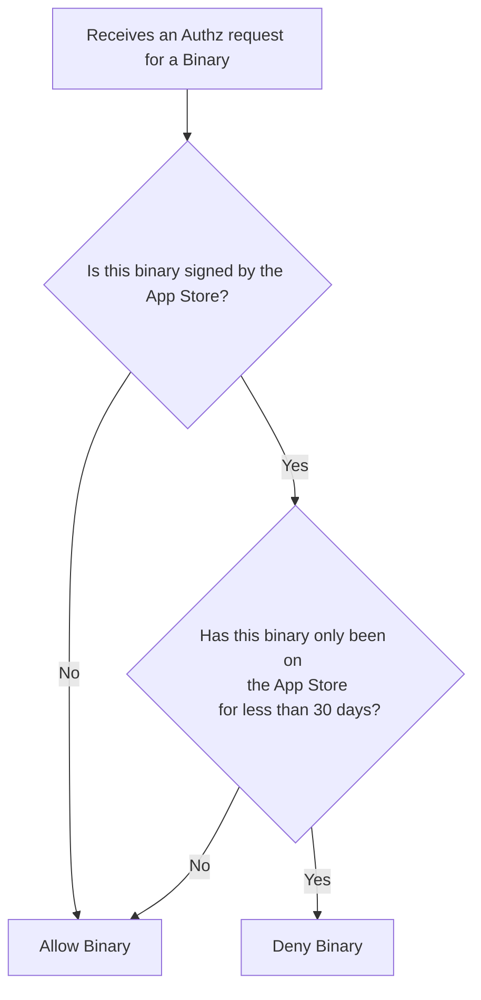
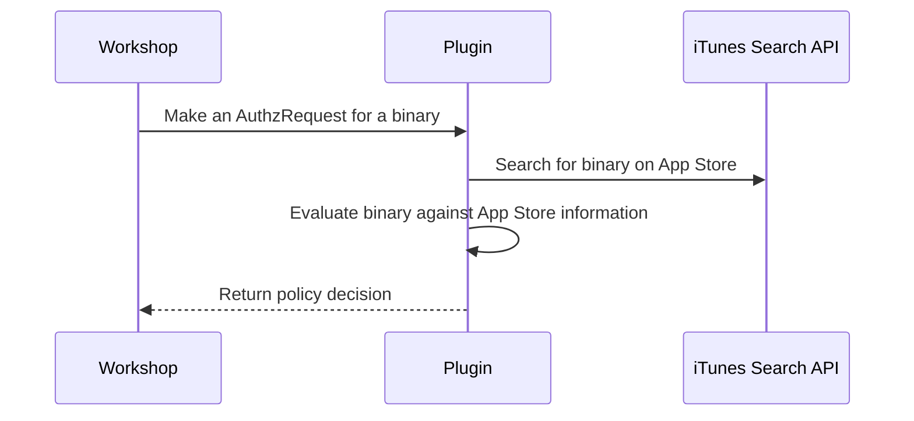

# Remote Risk Engine Demo

This repository shows how to write a basic remote risk engine plugin
for North Pole Security's Workshop.

> [!WARNING]  
> This code is intended only for demo purposes and should not be
considered production ready.
>
> The iTunes Search API is limited to 20 queries per minute and
> This server uses hard coded secrets.

## Building 

- Simply run `go build -o plugin-server ./cmd/server.go`

## Running

- Just run the resulting binary `./plugin-server`

## Configuring Workshop to Use the Remote Risk Engine Plugin

- 1. Use the `Settings API` to ensure the risk engine is enabled and configured to use the remote risk engine
- 2. Use configure the `CheckBlockable` API call to invoke the risk engine 
- 3. Watch the plugin server's output to see it receive requests and make decisions.

## Policy Enforced by the Plugin

This plugin uses the code signing information of a binary to see if
it's from the App Store. It then checks the iTunes Search API to see
when the first release of the application was added to the App Store.
If it was added less than 30 days prior the plugin returns a deny
response and allows otherwise.

This can be summarized as follows:

## Interactions

